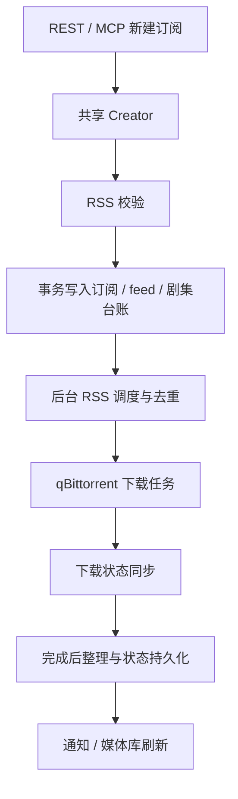

# Auto-RSS 服务化改造

基于 `main` / `7106f52618db`，目标是用 REST/MCP 管理订阅，让后台独立运行，并保留下载完成后的整理。本文记录代码范围和本地验证，实际发布状态以部署记录为准。

## 本次范围

| 能力 | 处理方式 |
|---|---|
| 管理页面 | 移除 Vue 源码、静态路由、嵌入资源和 Node.js 构建步骤 |
| REST / MCP | 作为管理入口；完整批量、分组、多 feed 管理仍通过 REST 提供 |
| RSS、去重、剧集台账 | 保留现有流程；MCP 新建复用 REST 的创建模块 |
| 下载状态同步 | 保留 qBittorrent 每 30 秒同步，获取完成与失败状态 |
| 完成后整理 | 保留重命名、移动、NFO 和按配置触发的媒体库刷新 |
| 媒体目录监听 | 移除 watcher、启动时递归目录遍历及其独立恢复循环 |
| 磁盘扫描、容量监控、自动空间清理 | 基线提交已经移除，本次不恢复 |
| SQLite 日志 | 默认关闭新日志写入，按需启用，并修正保留策略 |
| 历史数据 | 没有新增删除数据的迁移；废弃配置留在库中但不再启动监听 |

下载完成整理仍需要媒体路径访问权限。用户手动发起的资源替换及其恢复流程继续保留，其中的旧资源清理属于替换事务，而非磁盘容量驱动的自动清理。

## 核心执行关系



MCP 和 REST 共用 `internal/service/subscription.Creator`，避免各自拼装持久化状态。接口层负责输入与输出，创建模块负责 feed 校验、基线初始状态和事务。

## 已复现并修复

### MCP 创建成功但没有可调度的 feed

旧的 `create_subscription` 直接调用订阅仓储，只写 `subscriptions`。当前调度器从 `subscription_feeds` 读取启用源，因而这类新增订阅没有可调度的 feed。旧入口也没有检查 RSS 可用性。

回归命令：

```bash
go test ./internal/mcpserver -run TestMCPCreateSubscription -count=1
```

修复前：有效 RSS 创建后启用 feed 数为 0；不可用 RSS 仍返回成功。修复后：同一事务生成订阅、启用 feed 和剧集台账；不可用 RSS 返回错误且订阅数为 0。重复提交同一 URL 返回既有订阅，不额外创建 feed。

首次自动同步继续采用现有的历史基线语义，不会因改造而自动补下历史条目。

部署前核对现网时发现服务器已有未推送修复 `ad3ecb3`：禁止把 Mikan `/RSS/MyBangumi` 账户级聚合源作为单部番剧订阅。该保护及其回归测试已移植到本次版本，覆盖新建、feed 校验和调度处理，避免升级后丢失线上已有保护。

### 日志清理无法追上积压

旧实现每小时最多触发一次维护，每轮只删除最旧的 2,000 条超额日志；写入超过该速度时，10,000 条并不是有效的保留上限。

回归命令：

```bash
go test ./internal/pkg/logger -run TestDBWriterCleanupCatchesUpWithLogBacklog -count=1
```

测试先插入 16,000 条未过期日志，再通过真实日志写入路径触发维护。修复前无法回到 10,000 条；修复后分批消化本轮积压，并保留最新诊断记录。维护仍按小时节流，两轮之间不是严格的实时上限。

默认 `LOG_DB_ENABLED=false` 避免一般运行日志持续写入业务 SQLite。显式启用后，数据库日志遵循 `LOG_LEVEL`，最低为 `info`；设置 `warn` 不再额外保存 `info`。

已有数据库日志不会因默认关闭而自动清除或压缩；stderr 的落盘和轮转由运行环境管理。

### 静态检查发现的 SMTP 地址拼接问题

`go vet` 报告旧 SMTP `host:port` 拼接不支持 IPv6。STARTTLS 和 TLS 两条路径统一改用 `net.JoinHostPort`。本次没有发送测试邮件。

### 启动迁移遗漏标签表

部署前现网 `GET /api/v1/tags` 返回 500，数据库缺少 `subscription_tags` 和 `subscription_tag_relations`。启动迁移遗漏这两个模型，而原 API 测试自行建表，未能覆盖真实启动路径。现已补齐启动建表；`TestStartupMigrationSupportsTagManagement` 通过真实迁移和仓储验证标签创建、关联及重复启动后的数据保留。迁移只补表，不删除历史业务数据。

## 验证结果

- `go test ./... -count=1`：全部通过，25 个有测试的包。
- `go test -race ./internal/pkg/logger ./internal/mcpserver -count=1`：通过。
- `go vet ./...`：通过。
- `go build -buildvcs=false -o .cache/auto-rss-service ./cmd/server`：通过，不依赖前端文件。
- 下载完成后的单集/合集重命名、NFO、失败保持活动状态、剧集台账事务等现有测试通过。

实际二进制另在临时目录中启动，使用本地 RSS/qBittorrent 模拟服务和临时 SQLite，验证了：

| 检查 | 结果 |
|---|---|
| `/live`、`/ready`、REST 订阅查询 | 成功 |
| 根路径、静态资源、旧 watcher/磁盘路由 | JSON 404 |
| MCP 无凭据请求 | 401 |
| MCP initialize 和创建订阅 | 成功 |
| 同一 RSS 连续创建两次 | 1 个订阅、1 个启用 feed、12 个剧集台账 |
| MCP 刷新触发实际 RSS 调度 | 成功建立历史基线 |
| 历史内容自动下载 | 0 条 |
| 默认数据库日志 | 0 条 |
| 旧 `FILE_ORGANIZER_*` 环境变量 | 不再启动目录监听 |
| SIGTERM 后退出 | 退出码 0 |

这证明本地服务与模拟上游的执行链路，不代表真实下载器、NAS 路径或实际媒体整理已经在生产验证。本次未运行 Docker 镜像构建。

## 后续服务演进

1. 把 REST 的编辑、多 feed、分组和批量操作逐步映射为少量 MCP 工具，继续复用同一业务模块。
2. 用真实环境中的失败任务和日志复现剩余不稳定现象，重点验证下载完成回调、整理失败重试和服务退出期间的在途任务。
3. 若需要高频数据库日志，将可选写入器改为有界队列、批量写入和可等待的关闭流程；当前可选实现仍按日志异步写入，默认模式不启用它。

部署步骤、备份与回退见 [DEPLOY.md](DEPLOY.md)。
