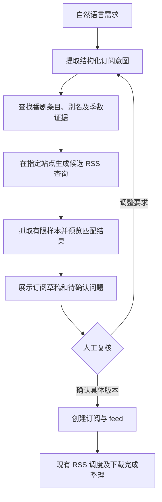

# 自然语言发现与订阅复核方案

日期：2026-09-27。第一版已在当前工作区实现并完成本地验证，尚未发布。下文保留设计依据；实际交付范围和限制以紧接着的“第一版实现范围”为准。

## 第一版实现范围

- 已实现 `prepare_subscription` / `confirm_subscription` MCP 工具，以及 `/api/v1/subscriptions/prepare` / `confirm` REST 入口，共享 `subscriptiondiscovery` 模块。
- 搜索返回多个动画候选；选定 Bangumi ID 后补全名称、别名、日期、集数和动画关系。蜜柑显式条目链接用于校验跨站 ID，Nyaa 和动漫花园查询分别按站点参数编码生成。
- 预览列出每种判断的有限样本。统一匹配规则用于发现、REST 预览和实际 RSS 调度；旧订阅继续沿用旧关键词语义。
- 草稿 30 分钟有效、最多 200 条未确认草稿、每份最多 128 KiB。确认与业务创建在同一数据库事务中，重复确认不会重复创建；已确认草稿仅保留轻量的关联记录。
- 每次准备查询预算 45 秒，超时保留已有预览，随后最多 5 秒保存草稿、每次外部请求最多 12 秒，响应最多 4 MiB。默认 provider 串行请求外部站点，缓存 5 分钟、最多 64 项且总计不超过 16 MiB；最多 6 个 feed，在请求的来源间轮流分配名额，每个最多检查 100 条，最多展示各决策类型 4 个样本。
- 支持第一/后续季的明确标记、已确认的连续集号偏移以及蜜柑单番范围证据。无法确认季数的资源不会猜测放行；站点标记和条目身份不是一回事。
- 首版只支持新建追新订阅，不在确认时补历史集数，不修改已有订阅，不支持合集自动选择或自动换源；画质偏好排序限于选定 RSS 同次返回的条目，不做跨 feed 全局择优。补集继续使用现有手动采集；更多来源、偏好学习和完整回填方案是后续工作。
- 新建发现草稿默认排除 720p、优先 1080p；其他画质待复核，后台等待 1080p。支持每份草稿覆盖策略；显式 `resolution` 是硬要求，覆盖默认画质策略。旧规则不自动升级。
- 自然语言由 MCP 客户端理解，服务接收结构化条件。运行服务无需内置大模型。`fansub` 在本版是必须匹配的条件，客户端不能把“优先”误转成硬性条件。
- 重命名预览使用默认模板和示例 `.mkv` 扩展名，实际完成整理使用部署的模板与真实扩展名。当前待核验资源通过草稿样本展示，后台会跳过不满足已确认规则的条目；尚未新增持久化待审核队列。

验收覆盖真实启动迁移、预览无下载副作用、过期/旧版本拦截、并发确认幂等、MCP HTTP 调用链及调度筛选一致性。真实只读样例见 [落第贤者预览](examples/subscription-discovery-rakudai.md)。

## 目标与交互

用户说出番剧名、所需季数和资源偏好，程序自动查找元数据、生成并验证资源查询，返回可复核的订阅草稿。用户确认草稿后才创建正式订阅并进入后台调度。

示例意图：

> 订阅《某番剧》第二季，简体中文、1080p，优先某字幕组，不要合集，只追后续更新。

“简体中文、1080p”是必须满足的条件，“优先某字幕组”是偏好。系统应保留这个区别；偏好没有匹配时可展示替代项，硬性条件没有匹配时不能自动放宽。



有明确歧义时先展示少量番剧候选。例如“第二季”可能表示第二部 TV 动画、第一季下半部分或媒体库编号；不能仅凭标题中有一个数字就确定对应条目。

## 内置画质条件与大模型分工

未指定画质时，准备阶段会把以下默认策略写入草稿，人工能看到并修改。确认后保存同一份策略；REST 预览和后台调度使用相同的过滤与排序。

```json
{
  "quality_policy": {
    "excluded_resolutions": [720],
    "preferred_resolution": 1080,
    "fallback": "wait"
  }
}
```

- `excluded_resolutions` 是硬排除，例如 720p、1280x720 均被排除。标题中没有可识别画质或有冲突标记时待核验，不自动放行。
- `preferred_resolution` 表示优先级，保持同画质条目的原始顺序。`fallback=wait` 时其他画质在准备预览中显示待核验，后台跳过并等待新的目标画质资源；不会建立常驻待审核队列或自动通知。
- 用户明确允许其他画质时设置 `fallback=allow`。同一个 RSS 同次拉取的合格资源中先选 1080p；没有 1080p 时可用可识别且未排除的画质。要同时排除 480p，可把排除列表设为 `[480,720]`。这不承诺以后一定出现 1080p，也不保证多个 feed 之间全局择优。
- 显式 `quality_policy` 整体覆盖默认值，需要提供完整的三个字段。显式 `resolution=1080` 是“只要 1080p”，独立于软偏好；`resolution=720` 可覆盖默认策略。显式策略内部冲突会报错，不静默放宽。
- Nyaa 只把硬性 `resolution` 加入自动生成的查询；软偏好保留其他画质候选，由本地校验。搜索返回的有限样本可能不含已有的优先画质，不能承诺完整召回。
- 已开始下载或已完成的集数不因后续出现优先画质而自动替换。新规则使用版本 2；版本 1 的草稿与旧订阅保持原语义。这些默认值属于发现入口，既有手动创建接口不隐式套用。

推荐在添加订阅时使用大模型：理解自然语言、提出有来源支持的别名和季数候选、根据实际 RSS 样本调整查询，再生成供用户复核的草稿。模型不能凭记忆编造 Bangumi ID 或宣称某 URL 已验证；工具负责查询、编码 URL、验证样本，硬过滤、集数映射、去重和后台下载由确定性代码执行。

当前 MCP 客户端中的模型即可承担这一层，无需服务内另接模型供应商。直接调用 REST 的调用方仍需传结构化字段，并不拥有自由文本理解能力。如果以后需要聊天机器人或直接接收自然语言的 HTTP 接口，再在现有准备接口前增加模型适配器。接入模型能减少手工填写，但复杂别名、分割放送仍可能判断错误；精准度需要以人工确认样本对比验证，不能由是否使用模型来保证。

## 当前代码可复用的内容与缺口

| 当前能力 | 已有实现 | 需要补齐 |
|---|---|---|
| Bangumi 搜索和详情 | `internal/service/bangumi`、MCP `search_bangumi` / `get_bangumi_subject` | 候选排序与证据；现有 `SearchByName` 直接取第一条，无法保证季数正确 |
| 蜜柑番剧、字幕组和 RSS 查找 | `internal/service/mikan`、相关 MCP 工具 | 与已确认的番剧条目关联，统一显示资源候选 |
| Nyaa RSS 解析 | `internal/service/rss` 支持 `nyaa:infoHash`，有回归用例 | 站点搜索、查询编译、上传者/类别等来源信息；能解析 RSS 不等于会生成精准查询 |
| feed 预览 | `subscriptionfeed.Service.Preview` | 当前主要检查 RSS 和正的相对集号，需增加番剧身份、季数和偏好校验 |
| 订阅预览 | REST `POST /api/v1/subscriptions/preview` | 当前仍要求用户先给出 RSS URL；可复用结果形式和重命名预览 |
| 过滤规则 | 订阅包含/排除关键词，预览和调度各有匹配逻辑 | 多个包含词按 OR 处理，不能直接表达“标题 AND 1080p AND 简中”；需统一结构化匹配 |
| 正式创建 | REST/MCP 共享 `subscription.Creator` | 由确认后的草稿调用，保留 feed/剧集记录事务和现有基线行为 |

当前 MCP `create_subscription` 的 `rss_url` 必填，`bangumi_id` 是可选输入。发现流程应放在它之前，并共用正式创建逻辑。

## 先确认番剧身份，再找资源

草稿中的条目识别需要保存：

- Bangumi ID、条目链接、中文/原文标题、检索到的别名、开播日期、作品类型、已知集数。
- 用户请求的季数，以及资源条目到媒体库 `season` 的映射。
- 上下部、前后篇、特别篇、剧场版等关联信息及其来源；不存在证据时保持未知。
- 资源使用本季集号还是连续集号；拟定 `episode_offset` 和至少一个具体映射例子。

名称、年份、类型、关联条目、资源站标题共同支撑候选选择。优先利用资源站显式给出的条目链接：本次实测蜜柑番剧页面包含 Bangumi subject 链接，可直接提取 ID，再读取详情核对作品和季数，减少纯名称搜索。该对应关系同样显示来源，出现冲突时交给用户确认。

搜索第一名、评分高或名称相似都不能单独证明是目标季。Bangumi 官方 API 没有统一的作品季序字段；条目集数未知时保留未知，不填入猜测值。`air_year` / 春夏秋冬与作品的第几季分开处理。

Bangumi 作为主要元数据来源，蜜柑、Nyaa 和动漫花园（`share.dmhy.org`）提供资源发现。额外元数据源用于补充别名和交叉核对；额外资源源需具有可验证的搜索/RSS 能力。当前已接入以上来源。来源调研见 [订阅发现来源调研](research/subscription-discovery-sources.md)。

## RSS URL 与本地匹配规则配合

Nyaa 的精确订阅需要保存两部分：站点能够表达的查询，以及服务自身执行的匹配规则。

1. 根据来源返回的名称和别名生成少量查询候选，例如原文标题、罗马字标题、字幕组或上传者范围。
2. 由站点适配器将支持的条件编码成合法 RSS URL；不让模型自行拼接、转义未经验证的站点语法。
3. 抓取候选 RSS，读取真实标题和站点提供的属性，运行与正式调度相同的匹配规则。
4. 展示保留、排除、无法判定的样本及原因，让用户比较覆盖范围与误匹配。
5. 保存选定 URL、查询的结构化条件、规则版本及核验时间；后续可修改意图并重新生成。

URL 用于缩小来源范围。本地规则继续验证目标作品、季/集数映射、语言、分辨率、字幕组偏好及单集/合集等条件。站点的 trusted 标记、发布者身份和作品匹配结果分别展示，不能相互代替。

2026-09-27 有限实测中，一个 Nyaa 标题查询的 RSS 返回 75 条，混合 Raw、英文翻译、单集、全集包及多种分辨率；一个蜜柑番剧/字幕组 RSS 返回 72 条，同一集存在 ABEMA、CR、Baha 版本。这些是特定请求的快照，不代表全站统计，也不足以推导通用准确率。具体请求和来源见调研文档。

新规则需明确 AND、OR 和排除条件的结构：标题别名之间可以 OR，标题与必需画质/语言条件之间是 AND。旧订阅保留原关键词语义，不能通过全局把 OR 改成 AND 来升级。

只从已返回的有限样本判断当前效果。RSS 可能截断结果，空结果可能是尚未开播、标题未匹配或站点异常，不能显示“精准率 100%”或“已找到全集”。建议状态为“已验证样本”“暂未找到资源”“身份待确认”“来源不可用”。

新条目无法确认季数或必须条件时，保留待复核原因，避免自动提交下载。日常匹配执行已确认的确定性规则，不逐条调用大模型；补充规则或更换来源后重新预览。普通新集出现无需再次逐集审批。

## 动漫花园候选来源

新增 `dmhy`，默认与 `mikan`、`nyaa` 一起查询，也可通过 `sources` 单独选择。程序从已选 Bangumi 条目的中文名和原文名各生成一个简单查询，最多两个；使用 `dmhy_query` 时只使用该表达式。搜索页面和 RSS 分别使用 `/topics/list?keyword=...` 与 `/topics/rss/rss.xml?keyword=...`，参数统一做 URL 编码。

本站不能照搬 Nyaa 的搜索词和筛选参数。实测“作品名 + 1080”为空、“作品名 + 1080p”有结果，因此自动查询保留作品名，由共享规则检查 1080p、1920x1080 等写法。Nyaa 的上传者、类别和 trusted 参数不作用于本站；动漫花园的关键词结果不能作为单季范围证明。

RSS 返回磁力链接，Base32 BTIH 转换成标准 40 位十六进制 hash，用于与下载器、其他来源一致地识别资源。动漫花园磁力 enclosure 的 `length="1"` 按未知大小处理，不当作 1 字节触发小文件拦截；其他来源和真实大小值保留原规则。

字幕组采用两阶段选择。宽搜阶段读取每条结果在搜索页上的 `team_id` 链接，按团队汇总资源条数、覆盖集数、规则命中集数和标题样例，返回 `group_candidates`。这些统计只属于当前作品和当前搜索快照；用户选定候选后，把其 `id` 作为 `dmhy_team_id` 重新准备，服务生成包含 `team_id:数字` 的窄 RSS。这样能保留人工复核，又不会把标题开头的联合组名误当成动漫花园的唯一发布者。若搜索页没有对应团队链接，资源仍可展示，但不会自动获得可复用的团队 ID。

三个来源仍共享最多 6 个候选名额，并按来源轮流分配，避免最后一个来源被全部截掉。原有 45 秒查询预算、外部请求和缓存上限不增加。每个来源的失败单独展示，超时继续保留已经取得的预览。实际只读验收见 [动漫花园样例](examples/subscription-discovery-dmhy.md)。

## 人工复核看到什么

以对话中的表格和链接展示即可，不依赖新增管理页面。

| 内容 | 展示要求 |
|---|---|
| 番剧身份 | 中文/原文名、条目链接与 ID、开播时间、类型和集数 |
| 季数说明 | 对应哪个条目、媒体库 season、是否分割放送或特别篇 |
| 资源候选 | 站点、字幕组/上传者、RSS URL、来源链接、最后核验时间 |
| 筛选条件 | 必须条件和优先条件分开；能否判断语言/画质/合集 |
| 匹配证据 | 少量真实标题、解析的集号、命中/排除/未知原因 |
| 整理预览 | 集数偏移和示例目标文件名 |
| 起始行为 | 仅追新，或明确列出要补的历史集数 |
| 待确认事项 | 多个条目冲突、未识别语言、资源为空、重复订阅等 |

用户可直接说“用第二个源”“只要这个字幕组”“这是下半部分，保存为第一季”。修改后生成新版本草稿，再确认。已确认的番剧条目和规则不得在创建时被名称富化流程重新猜测覆盖。

## 对外接口与内部模块

已新增 `subscriptiondiscovery` Module，让 REST 与 MCP 共享同一套 Implementation。对外 Interface 保持两项主要操作，接口如下：

- `prepare_subscription`：接收结构化意图，以及可选的草稿 ID、候选选择或偏好调整；返回草稿版本、番剧/资源候选、样本、来源和未解决问题。
- `confirm_subscription`：接收草稿 ID 与用户复核的版本；验证后调用现有 Creator，返回新订阅或已创建的同一订阅。

自然语言先由现有 MCP 客户端的 AI 转换成结构化意图。服务负责查证与预览，不要求后台安装模型或永久依赖模型在线。今后若增加直接接收自然语言的 HTTP 入口，可以在同一 Interface 前增加意图解析 Adapter。

内部需要两个确有差异的扩展位置：元数据 Adapter 和资源发现 Adapter。蜜柑返回节目/字幕组 RSS，Nyaa 编译查询 RSS，各自封装站点语法。来源配置描述适配器类型、真实站点地址及支持能力；仅增加网址不代表自动支持一个新站点。

共享的匹配 Module 同时服务于发现预览、现有 REST 预览和新订阅的实际调度，集中处理规则与解释。保留旧规则兼容模式，避免两处匹配逻辑继续分叉。

## 草稿、确认与后台运行

- 准备阶段只查询网络、执行解析和保存有限草稿；不创建启用订阅、不提交下载、不访问媒体目录。
- 草稿记录 `draft_id`、`revision`、结构化条件、来源证据摘要、样本时间和到期时间。修改关键内容使旧版本失效。
- 确认必须指向具体版本；过期后重新核验。新样本变化可展示增量，条目身份/来源/硬性条件发生变化则要求重新复核。
- 确认重复调用返回同一结果；草稿确认记录与正式创建需具备原子性。已提供现有 Creator 的事务内创建入口，不能依靠“先查再写”避免重复。
- 待确认的季数映射、来源异常或身份冲突不能自动标记为已解决。
- 默认沿用“首次建立历史基线、只追后续”的行为。若用户选择补集，预览明确剧集范围，再调用既有手动采集流程；不能把建订阅隐式变成全量下载。
- 继续提供已有手动创建入口。人工确认是发现流程约束，不宣称其他现有接口自动获得服务端的人类身份验证能力。

## 请求与存储成本

首次发现由用户请求触发，按站点限制并发、查询候选数量、响应大小和总耗时；遵守站点实际限流并在失败时退避。给 metadata/查询结果配置不同缓存时效，复用同一站点的等价查询。具体数值在真实延迟和站点规则确认后确定。

只保存小型草稿、有限样本和必要的匹配理由，设定容量与过期策略；不保存全站页面快照，不进行定期全站爬取。过期草稿的数据库维护与已经移除的媒体磁盘清理是不同的功能。

正式运行继续抓取用户确认的 feed。日志默认仍输出 stderr，不恢复大量 SQLite 运行日志。网络采集的代价仍需控制，不能把移除磁盘扫描当成采集可以无限扩大的理由。

## 首版实施与验收

首版范围：Bangumi 候选识别、蜜柑/Nyaa/动漫花园 资源发现、结构化规则、两阶段 MCP 草稿与确认。多站点注册市场、自动变更已确认偏好、独立管理页面不在首版范围。

建议先用几组人工已经确认的真实 Nyaa 查询和目标番剧作为验收样本，记录“应该收进来的标题”和“容易误收的相似标题”。这些样本用于证明自动化是否减少手工调试，不把个别样本成功当成所有番剧都准确。

重点验收：

1. 同名不同年份、第一/第二季、分割放送、OVA/剧场版混在结果中时，能展示正确证据或明确保留歧义。
2. 中文/日文/罗马字别名可检索；分辨率、字幕语言和字幕组的组合条件不会退化成多个词任一命中。
3. 预览与调度使用同一规则，样本判断一致；Nyaa 上传者和字幕组没有被视为同一身份。
4. 限流、空 RSS、超时、结果截断、标题缺失信息分别返回可理解的状态，未确认前没有下载副作用。
5. 草稿修改后旧确认失效，重复确认不会重复订阅；确认的 Bangumi ID 不被后续富化替换。
6. 只追新不补旧；选择补集时严格采用用户复核的范围；集数偏移和重命名保持一致。

实施时以这些业务行为建立测试，再逐步接入真实站点进行有限在线验证。首版已实现的内容以上方实现范围、MCP/API 文档和当前代码为准；完整规划中的历史补集、偏好学习和自动换源仍未纳入确认流程。
